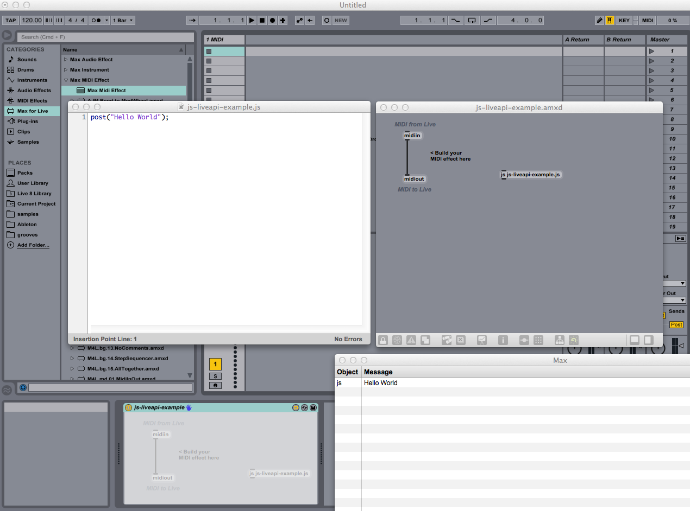

# JS Live API » #1 Setup

> Attribution: Content adapted from Adam Murray’s “JS in Live” tutorials, licensed under CC BY-NC-SA 4.0. Original: https://adammurray.link/max-for-live/js-in-live/ — Changes have been made. Not endorsed by Adam Murray or Cycling '74. License: https://creativecommons.org/licenses/by-nc-sa/4.0/

This is the 1st of a series of articles about hacking on Ableton Live with JavaScript. These articles assume you own Ableton Live 9 Suite and are comfortable coding JavaScript.

## Overview

This article explains the setup to run JavaScript code inside Live. If you are already familiar with this setup, you can skip ahead to the next article.

## Summary of Steps

1. Add a Max Midi Effect device and edit it
2. Add a "js your-filename.js" object to the Max device
3. Lock the Max device and double-click the js object to open the JavaScript editor
4. Save the JavaScript file
5. Save the Max device in the same folder as the JavaScript file
6. Bug alert! Now close the Max device and edit it again. The Max device can't find the JavaScript file until we "reboot" like this. This bug should be fixed in the future.
7. Open the Max Window for logging debug info
8. Start coding
9. Save the JavaScript file to run your code

## Detailed Steps

We're going to interact with Live directly through the LiveAPI, so our Max device will not alter the incoming signal. I usually use a MIDI effect in this situation, but you could use an audio effect. The important thing is the MIDI/audio input is passed directly to the MIDI/audio output. These instructions assume we're using a MIDI effect.

Find "Max Midi Effect" under the Max for Live section of the Live browser inside the "Max MIDI Effect" folder. Drag it to a MIDI track (I recommend using a dedicated track to stay organized), then click its edit button. Max will launch, and after a few moments the Max Editor window will appear.

### Creating the JavaScript Object

Double click in some empty space in the Max Editor window, and the Max Object Explorer will appear (if it doesn't, make sure the device is unlocked by using the lock button in the lower left). Type "javascript" into the search box of the Object Explorer. Under the languages category we see "js". Drag "js" into your device and type in a filename, so we have an object that looks like "js your-filename.js".

Pro tip: Learn Max keyboard shortcuts. If you type "n" in an unlocked device, it will add an object. Then you can type "js your-filename.js" and hit enter to create a js object.

### Testing it Out

Every time you save the code in Max's JavaScript editor, it will run. As a quick test, try this simple program:

```javascript
post("Hello World!");
```

You should see "Hello World!" in the Max window, like in this screenshot:



## Next Steps

Alright! Now you're ready to write JavaScript programs inside Ableton Live. In the next article, we'll learn how to set some useful utility code to help us debug our scripts.