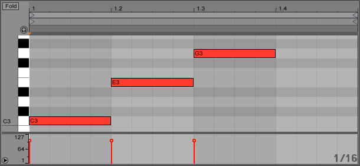
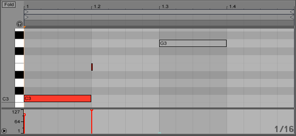
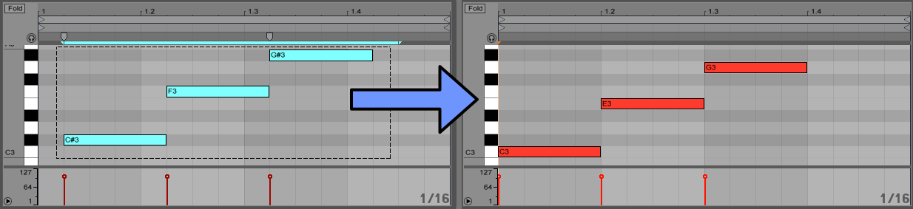

# 4-B Writing MIDI Clips

> Attribution: Content adapted from Adam Murray’s “JS in Live” tutorials, licensed under CC BY-NC-SA 4.0. Original: https://adammurray.link/max-for-live/js-in-live/ — Changes have been made. Not endorsed by Adam Murray or Cycling '74. License: https://creativecommons.org/licenses/by-nc-sa/4.0/

This is part of a series of articles about hacking on Ableton Live with JavaScript. These articles assume you own Ableton Live 9 Suite and are comfortable coding JavaScript.

In this article, we'll learn how to modify the notes inside a MIDI clip. It's the second half of a 2-part article about working with notes in MIDI clips, so read the first half if you haven't already.

This article builds upon the previous articles, so refer back to them if you're having trouble here.

## Getting Started

Again, let's paste in our `log()` function that we built in article #2: Logging & Debugging. The rest of this article assumes the `log()` function is in your script.

```javascript
function log() {
  for (var i = 0, len = arguments.length; i < len; i++) {
    var message = arguments[i];
    if (message && message.toString) {
      var s = message.toString();
      if (s.indexOf("[object ") >= 0) {
        s = JSON.stringify(message);
      }
      post(s);
    } else if (message === null) {
      post("<null>");
    } else {
      post(message);
    }
  }
  post("\n");
}

log("___________________________________________________");
log("Reload:", new Date);
```

And below that, we'll paste in the code we wrote in the previous article to access the selected MIDI clip's notes:

```javascript
//--------------------------------------------------------------------
// Clip class

function Clip() {
  var path = "live_set view highlighted_clip_slot clip";
  this.liveObject = new LiveAPI(path);
}

Clip.prototype.getLength = function() {
  return this.liveObject.get('length');
}

// ... (other methods omitted for brevity) ...

//--------------------------------------------------------------------
// Note class

function Note(pitch, start, duration, velocity, muted) {
  this.pitch = pitch;
  this.start = start;
  this.duration = duration;
  this.velocity = velocity;
  this.muted = muted;
}

Note.prototype.toString = function() {
  return '{pitch:' + this.pitch +
         ', start:' + this.start +
         ', duration:' + this.duration +
         ', velocity:' + this.velocity +
         ', muted:' + this.muted + '}';
}

// ... (other methods omitted for brevity) ...

//--------------------------------------------------------------------
// Humanize behavior

function humanize(type, maxTimeDelta, maxVelocityDelta) {
  var humanizeVelocity = false,
      humanizeTime = false;

  switch (type) {
    case "velocity": humanizeVelocity = true; break;
    case "time": humanizeTime = true; break;
    default: humanizeVelocity = humanizeTime = true;
  }

  if (!maxTimeDelta) maxTimeDelta = 0.05;
  if (!maxVelocityDelta) maxVelocityDelta = 5;
  
  clip = new Clip();
  notes = clip.getSelectedNotes();
  notes.forEach(function(note) {
    if (humanizeTime) note.start += maxTimeDelta * (2 * Math.random() - 1);
    if (humanizeVelocity) note.velocity += maxVelocityDelta * (2 * Math.random() - 1);
  });
  clip.replaceSelectedNotes(notes);
}

//--------------------------------------------------------------------

humanize();
```

## Writing Notes to a MIDI Clip

The Live Object Model documentation for the Clip object shows there's a `set_notes` function that works like this:

- **Parameter:** `list_of_notes` [pitch, time, duration, velocity, is_muted]
- Will apply the given notes to the clip, overwriting existing notes.

An example sequence of calls looks like this:

```javascript
call set_notes
call notes 2
call note 60 0.0 0.5 100 0
call note 62 0.5 0.5 64 0
call done
```

For MIDI clips only. Let's add a function to the bottom of our JavaScript Clip class. It takes a list of our JavaScript Note objects as the parameter and calls the Live API `set_notes` function with the note data:

```javascript
Clip.prototype.setNotes = function(notes) {
  var liveObject = this.liveObject;
  liveObject.call("set_notes");
  liveObject.call("notes", notes.length);
  notes.forEach(function(note) {
    liveObject.call("note", note.pitch, note.start, note.duration, note.velocity, note.muted);
  });
  liveObject.call("done");
}
```

To test it out, replace the bottom of our script (after the Note class definition) with this code. Here we're trying to set the clip to have an arpeggiated C major chord (one beat each of C3, E3, G3):

```javascript
var notes = [];
notes.push(new Note(60, 0, 1, 100, 0));
notes.push(new Note(64, 1, 1, 100, 0));
notes.push(new Note(67, 2, 1, 100, 0));

var clip = new Clip();
clip.setNotes(notes);
```

Hmm... That doesn't work:

- Invalid syntax: 'note 60 1 1 100 0'
- Invalid syntax: 'note 64 2 1 100 0'
- Invalid syntax: 'note 67 3 1 100 0'
- Wrong note count

Let's debug. Replace the code at the end of our script with a direct attempt to call the `set_note` function (bypassing our Clip and Note classes):

```javascript
var path = "live_set view highlighted_clip_slot clip";
var liveObject = new LiveAPI(path);

liveObject.call("set_notes");
liveObject.call("notes", 1);
liveObject.call("note", 60, 0, 1, 100, 0);
liveObject.call("done");
```

It gives the same error. I spent a while debugging this, and eventually stumbled across a solution. The documentation gave an example containing the line "note 62 0.5 0.5 64 0". If we change our start time and duration to 0.5, then it works! There seems to be a bug converting JavaScript integer numbers to Max floating point messages (which I have reported to Cycling '74 so hopefully it will be fixed in the future). I found that giving a string value containing a decimal point avoids the problem:

```javascript
var path = "live_set view highlighted_clip_slot clip";
var liveObject = new LiveAPI(path);

liveObject.call("set_notes");
liveObject.call("notes", 1);
liveObject.call("note", 60, "0.0", "1.0", 100, 0);
liveObject.call("done");
```

If it doesn't look like this script is doing anything, try deleting all the notes in the currently selected MIDI clip. Then when you save the script it should create a C3 note at the beginning of the clip.

We can generalize this workaround with the built-in `toFixed()` function for numbers in JavaScript. This function takes a parameter for the number of digits to appear after the decimal point, and returns the number as a string. Let's update our Clip `setNotes()` function to use this workaround. We'll output 4 digits after the decimal place, which should provide plenty of accuracy.

```javascript
Clip.prototype.setNotes = function(notes) {
  var liveObject = this.liveObject;
  liveObject.call("set_notes");
  liveObject.call("notes", notes.length);
  notes.forEach(function(note) {
    liveObject.call("note", note.pitch,
                    note.start.toFixed(4), note.duration.toFixed(4),
                    note.velocity, note.muted);
  });
  liveObject.call("done");
}
```

And replace the code at the bottom with what we had before:

```javascript
var notes = [];
notes.push(new Note(60, 0, 1, 100, 0));
notes.push(new Note(64, 1, 1, 100, 0));
notes.push(new Note(67, 2, 1, 100, 0));

var clip = new Clip();
clip.setNotes(notes);
```



You should see 3 notes be created in your clip (again, you may need to delete existing notes first to see the new notes appear).

## Handling Out-of-Bounds Values

If you spend time playing around with the code we've written so far, you will probably have more issues. For example, try this code:

```javascript
var notes = [];
notes.push(new Note(60, 0, 1, 128, 0));
var clip = new Clip();
clip.setNotes(notes);
```

We get an error `Invalid syntax: 'done'`, which is not very helpful. But with some thought, we might realize that a MIDI velocity value of 128 is higher than the maximum velocity value 127. We see similar behavior if we try using a negative velocity. So we need to be careful about calling `set_notes` with valid values.

We could keep enhancing our Clip `setNotes()` function to ensure our velocity is in a valid range. However, I decided I'd like to make it the responsibility of the Note class to enforce that the note properties are valid with some getter functions. Add the following code after the Note class's `toString()` function:

```javascript
Note.MIN_DURATION = 1/128;

Note.prototype.getPitch = function() {
  if (this.pitch < 0) return 0;
  if (this.pitch > 127) return 127;
  return this.pitch;
}

Note.prototype.getStart = function() {
  // we convert to strings with decimals to work around a bug in Max
  // otherwise we get an invalid syntax error when trying to set notes
  if (this.start <= 0) return "0.0";
  return this.start.toFixed(4);
}

Note.prototype.getDuration = function() {
  if (this.duration <= Note.MIN_DURATION) return Note.MIN_DURATION;
  return this.duration.toFixed(4); // workaround similar bug as with getStart()
}

Note.prototype.getVelocity = function() {
  if (this.velocity < 1) return 1;
  if (this.velocity > 127) return 127;
  return this.velocity;
}

Note.prototype.getMuted = function() {
  if (this.muted) return 1;
  return 0;
}
```

The `MIN_DURATION` is somewhat arbitrary. I decided that, for practical purposes, if I try to make a note shorter than a 1/128th note, its duration will be 1/128. I used a `MIN_DURATION` constant so that this value can be easily changed in one place. Change it if you want.

Also, note that the start time for the note can actually be a negative number and this doesn't cause an error. Then the note starts before the beginning of the clip and you'll never hear it (at least, not normally. Apparently, clips can have negative start times too). I decided to ensure that the start time is at least 0. Perhaps you will come up with some creative reasons to have a negative start time, so feel free to adjust this code.

Now we can adjust our Clip's `setNotes()` function to set the notes in a clip more robustly, avoiding errors in a lot of cases:

```javascript
Clip.prototype.setNotes = function(notes) {
  var liveObject = this.liveObject;
  liveObject.call("set_notes");
  liveObject.call("notes", notes.length);
  notes.forEach(function(note) {
    liveObject.call("note", note.getPitch(),
                    note.getStart(), note.getDuration(),
                    note.getVelocity(), note.getMuted());
  });
  liveObject.call("done");
}
```

And with that code, we can make some "mistakes" and notes can still be set on a clip:

```javascript
var notes = [];
notes.push(new Note(60, -1, 1, 100.5, 0));
notes.push(new Note(64, 1, 0, 128, false));
notes.push(new Note(67, 2, 1, -1, -1));

var clip = new Clip();
clip.setNotes(notes);
```



Ideally, we wouldn't make such "mistakes", but soon we're going to introduce a "humanize" feature that randomizes times and velocities. This code makes it so we don't have to worry about out-of-bounds values when working with random numbers.

## Replacing Notes

The Live API `set_notes` function for Clip's has a related, useful function called `replace_selected_notes`. The Live Object Model documentation indicates the syntax is the same. So when we introduce this function, we can rework some of the code into a helper function and keep all the logic in one place. This is similar to what we did when sharing a `_parseNoteData()` helper function between our Clip class's `getSelectedNotes()` and `getNotes()` functions in the previous article. Let's replace our existing `setNotes()` function with the following code:

```javascript
Clip.prototype._sendNotes = function(notes) {
  var liveObject = this.liveObject;
  liveObject.call("notes", notes.length);
  notes.forEach(function(note) {
    liveObject.call("note", note.getPitch(),
                    note.getStart(), note.getDuration(),
                    note.getVelocity(), note.getMuted());
  });
  liveObject.call('done');
}

Clip.prototype.replaceSelectedNotes = function(notes) {
  this.liveObject.call("replace_selected_notes");
  this._sendNotes(notes);
}

Clip.prototype.setNotes = function(notes) {
  this.liveObject.call("set_notes");
  this._sendNotes(notes);
}
```

Test that the `setNotes()` function is still working properly. Then try `replaceSelectedNotes()`:

```javascript
var notes = [];
notes.push(new Note(60, 0, 1, 100, 0));
notes.push(new Note(64, 1, 1, 100, 0));
notes.push(new Note(67, 2, 1, 100, 0));

var clip = new Clip();
clip.replaceSelectedNotes(notes);
```

To see that it's actually working as expected, move the C3, E3, and G3 notes that we've been generating to a different time/pitch, make sure the notes are selected, and run this script. The old notes should disappear and the original C3, E3, and G3 should replace them:



Note that if you drag the notes like this, and try calling `clip.setNotes(notes)` instead of `replaceSelectedNotes`, it adds notes to the clip and keeps the old notes. This behavior may be desirable in some situations, depending on what you are trying to do.

What if we want to replace all the notes in a clip without having to explicitly select them all? Let's add more functions to our Clip class to do this:

```javascript
Clip.prototype.selectAllNotes = function() {
  this.liveObject.call("select_all_notes");
}

Clip.prototype.replaceAllNotes = function(notes) {
  this.selectAllNotes();
  this.replaceSelectedNotes(notes);
}
```

And now we can replace all the notes in a clip like this:

```javascript
var notes = [];
notes.push(new Note(60, 0, 1, 100, 0));
notes.push(new Note(64, 1, 1, 100, 0));
notes.push(new Note(67, 2, 1, 100, 0));

var clip = new Clip();
clip.replaceAllNotes(notes);
```

## Humanizing a Clip

At this point, we have fairly robust Clip and Note classes for interacting with MIDI clips. So let's build something fun/useful: a "humanize" feature. I think of "humanizing" like the opposite of quantizing. Quantizing aligns your notes to the underlying time grid. Humanizing slightly misaligns the notes from the grid to simulate human imperfections. A simple implementation of this is to slightly randomize the note's times and/or velocities. Here's one way to do it:

```javascript
function humanize(type, maxTimeDelta, maxVelocityDelta) {
  var humanizeVelocity = false,
      humanizeTime = false;

  switch (type) {
    case "velocity": humanizeVelocity = true; break;
    case "time": humanizeTime = true; break;
    default: humanizeVelocity = humanizeTime = true;
  }

  if (!maxTimeDelta) maxTimeDelta = 0.05;
  if (!maxVelocityDelta) maxVelocityDelta = 5;
  
  clip = new Clip();
  notes = clip.getSelectedNotes();
  notes.forEach(function(note) {
    if (humanizeTime) note.start += maxTimeDelta * (2 * Math.random() - 1);
    if (humanizeVelocity) note.velocity += maxVelocityDelta * (2 * Math.random() - 1);
  });
  clip.replaceSelectedNotes(notes);
}
```

Rather than introduce separate functions for humanize time, velocity, and time+velocity, I wrote one parameterized function to do all three. You can call `humanize("velocity")` or `humanize("time")` to randomize just the velocity or just the time, otherwise both will be randomized.

Then we set default values for `maxTimeDelta` and `maxVelocityDelta` if needed. These optional parameters affect the maximum change to the time and velocity in either the positive or negative direction. The defaults were chosen to be relatively small but still have a noticeable effect.

Note that if `maxTimeDelta` is 0, then `(!maxTimeDelta)` will be true and we'll use the default value 0.05. There are other ways to handle default parameters in JavaScript, so that 0 doesn't turn into the default value like this. I choose this "naive" approach for readability.

We do the randomization by calling `Math.random()`, which returns a floating point number between 0.0 and 1.0. The expression `(2 * Math.random() - 1)` calculates a random number between -1.0 and 1.0. So when we multiply that expression by `maxTimeDelta`, it produces a number between `-maxTimeDelta` and `maxTimeDelta` (and similarly for `maxVelocityDelta`). This random number is added to the note's start time or velocity.

Here's the entire script (not including our `log()` function). Simply running this code will humanize both the time and velocity of the currently selected notes. Experiment with different parameters to the `humanize()` function call at the end, such as `humanize("time", 0.25)` and `humanize("velocity", 0, 64)`:

```javascript
//--------------------------------------------------------------------
// Clip class

function Clip() {
  var path = "live_set view highlighted_clip_slot clip";
  this.liveObject = new LiveAPI(path);
}

Clip.prototype.getLength = function() {
  return this.liveObject.get('length');
}

Clip.prototype._parseNoteData = function(data) {
  var notes = [];
  // data starts with "notes"/count and ends with "done" (which we ignore)
  for (var i = 2, len = data.length - 1; i < len; i += 6) {
    // and each note starts with "note" (which we ignore) and is 6 items in the list
    var note = new Note(data[i + 1], data[i + 2], data[i + 3], data[i + 4], data[i + 5]);
    notes.push(note);
  }
  return notes;
}

Clip.prototype.getSelectedNotes = function() {
  var data = this.liveObject.call('get_selected_notes');
  return this._parseNoteData(data);
}

Clip.prototype.getNotes = function(startTime, timeRange, startPitch, pitchRange) {
  if (!startTime) startTime = 0;
  if (!timeRange) timeRange = this.getLength();
  if (!startPitch) startPitch = 0;
  if (!pitchRange) pitchRange = 128;
  
  var data = this.liveObject.call("get_notes", startTime, startPitch, timeRange, pitchRange);
  return this._parseNoteData(data);
}

Clip.prototype._sendNotes = function(notes) {
  var liveObject = this.liveObject;
  liveObject.call("notes", notes.length);
  notes.forEach(function(note) {
    liveObject.call("note", note.getPitch(),
                    note.getStart(), note.getDuration(),
                    note.getVelocity(), note.getMuted());
  });
  liveObject.call('done');
}

Clip.prototype.replaceSelectedNotes = function(notes) {
  this.liveObject.call("replace_selected_notes");
  this._sendNotes(notes);
}

Clip.prototype.setNotes = function(notes) {
  this.liveObject.call("set_notes");
  this._sendNotes(notes);
}

Clip.prototype.selectAllNotes = function() {
  this.liveObject.call("select_all_notes");
}

Clip.prototype.replaceAllNotes = function(notes) {
  this.selectAllNotes();
  this.replaceSelectedNotes(notes);
}

//--------------------------------------------------------------------
// Note class

function Note(pitch, start, duration, velocity, muted) {
  this.pitch = pitch;
  this.start = start;
  this.duration = duration;
  this.velocity = velocity;
  this.muted = muted;
}

Note.prototype.toString = function() {
  return '{pitch:' + this.pitch +
         ', start:' + this.start +
         ', duration:' + this.duration +
         ', velocity:' + this.velocity +
         ', muted:' + this.muted + '}';
}

Note.MIN_DURATION = 1/128;

Note.prototype.getPitch = function() {
  if (this.pitch < 0) return 0;
  if (this.pitch > 127) return 127;
  return this.pitch;
}

Note.prototype.getStart = function() {
  // we convert to strings with decimals to work around a bug in Max
  // otherwise we get an invalid syntax error when trying to set notes
  if (this.start <= 0) return "0.0";
  return this.start.toFixed(4);
}

Note.prototype.getDuration = function() {
  if (this.duration <= Note.MIN_DURATION) return Note.MIN_DURATION;
  return this.duration.toFixed(4); // workaround similar bug as with getStart()
}

Note.prototype.getVelocity = function() {
  if (this.velocity < 0) return 0;
  if (this.velocity > 127) return 127;
  return this.velocity;
}

Note.prototype.getMuted = function() {
  if (this.muted) return 1;
  return 0;
}

//--------------------------------------------------------------------
// Humanize behavior

function humanize(type, maxTimeDelta, maxVelocityDelta) {
  var humanizeVelocity = false,
      humanizeTime = false;

  switch (type) {
    case "velocity": humanizeVelocity = true; break;
    case "time": humanizeTime = true; break;
    default: humanizeVelocity = humanizeTime = true;
  }

  if (!maxTimeDelta) maxTimeDelta = 0.05;
  if (!maxVelocityDelta) maxVelocityDelta = 5;
  
  clip = new Clip();
  notes = clip.getSelectedNotes();
  notes.forEach(function(note) {
    if (humanizeTime) note.start += maxTimeDelta * (2 * Math.random() - 1);
    if (humanizeVelocity) note.velocity += maxVelocityDelta * (2 * Math.random() - 1);
  });
  clip.replaceSelectedNotes(notes);
}

//--------------------------------------------------------------------

humanize();
```
